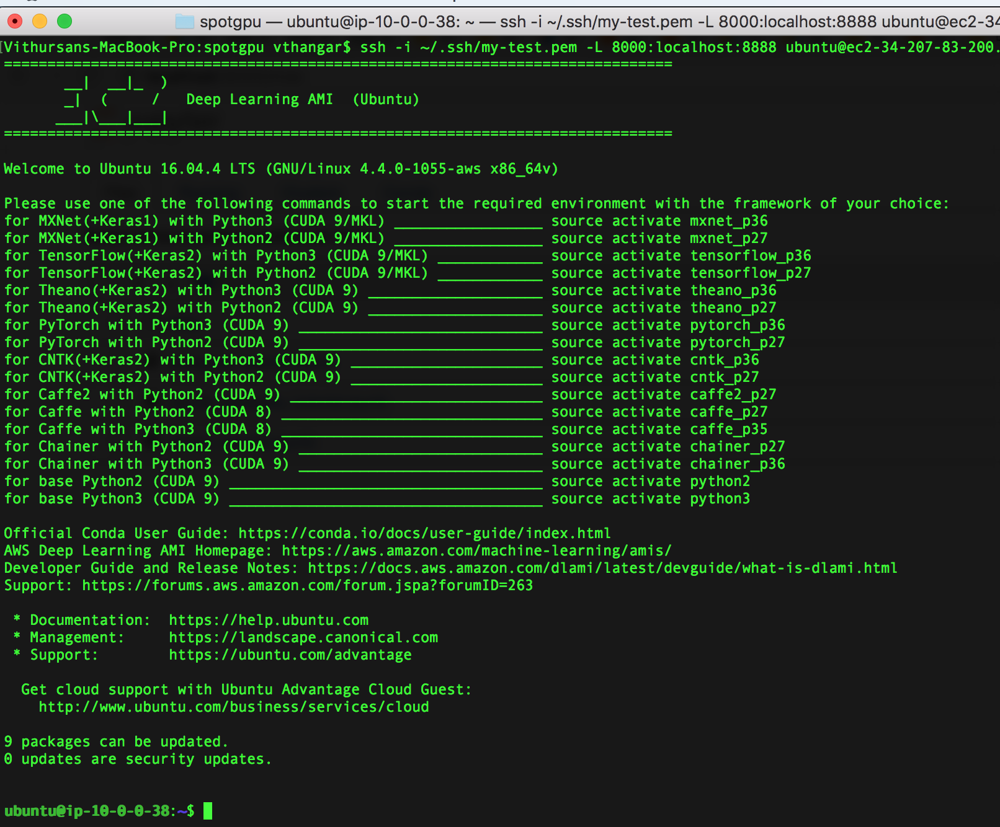
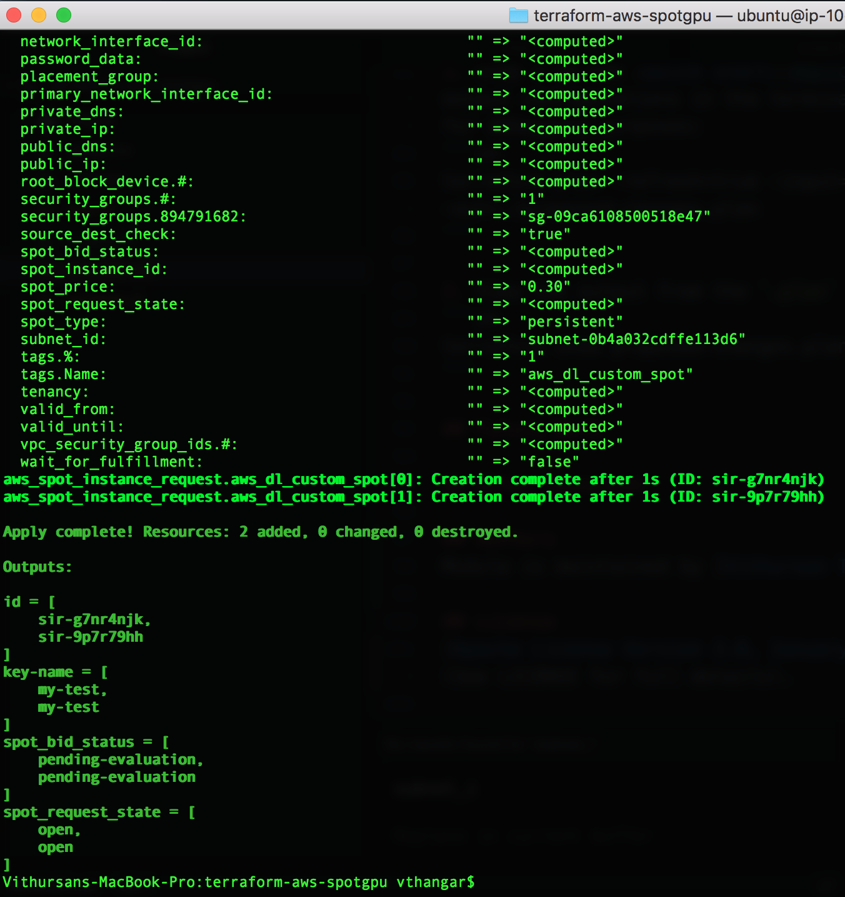

# Provisioning AWS Spot Instances for Deep Learning

This is a demo repository containing terraform module for provisioning EC2-based Spot Instances on AWS, specifically for Deep Learning workloads on Amazon's GPU-based instances.

*Development and testing was done on a macOS High Sierra version 10.13.3*

## Table of Contents
* [Requirements](#requirements)
* [Configurations](#configuration)
    * [Variables](#variables)
    * [Amazon Machine Image](#amazon-machine-image)
* [Quick Start](#quick-start)
* [Tips and Tricks](#tips-and-tricks)
    * [Debugging](#debugging)
* [Future Work](#future-work)
* [Other Resources](#other-resources)
* [Authors](#authors)
* [License](#license)

## Requirements
* [Terraform](https://www.terraform.io/) (tested on v0.11.7)
* [Amazon Web Services CLI (aws-cli)](https://aws.amazon.com/cli/)
* [AWS Key Pair](https://docs.aws.amazon.com/AWSEC2/latest/UserGuide/ec2-key-pairs.html#having-ec2-create-your-key-pair)

**Note: Terraform and aws-cli can be installed with `brew install` on Mac.**

## Configuration
#### Variables
This demo terraform script creates makes a Spot Instance request for a `p2.xlarge` in AWS and allows you to connect to a Jupyter notebook running on the server. This script could be more generic, but for now its only been tested on my own AWS setup, so I'm open to more contribution to the repo :)

In the `variables.tf` file some of the variables you can configure for your setup are:
```sh
    * my_region                 (default = us-east-1)
    * my_key_pair_name          (default = my-test)
    * instance_type             (default = p2.xlarge)
    * num_instances             (default = 1)
    * spot_price                (default = 0.30)
    * ebs_volume_size           (default = 1)
    * ami_id                    (default = ami-dff741a0)
```

**Note: The minimum spotPrice should follow the [AWS EC2 Spot Instances Pricing](https://aws.amazon.com/ec2/spot/pricing/), otherwise your request will not be fulfilled because the price is too low.**

#### Amazon Machine Image
In this demo, I am using the [AWS Deep Learning AMI](https://aws.amazon.com/marketplace/pp/B077GCH38C), because its free and provides you with `Anaconda` environments for most of the popular DL frameworks (see image below). Also, the software cost is **$0.00/hr**, and you don't have to worry about installing the NVIDIA drivers and DL software (i.e. TensorFlow, PyTorch, MXNet, Caffe, Caffe2, etc) manually.


<p align="left">
  <center></center>
  <center><i>AWS Deep Learning AMI - a list of conda environments for deep learning frameworks.</i></center>
</p>


## Quick Start
1. Check to see if Terraform is installed properly:
```sh
terraform
```

2. Initalize the working directory containing the Terraform configuration files:
```sh
terraform init
```

3. Validate the syntax of the terraform files:
```sh
terraform validate
```

4. Create the terraform execution plan, which is an easy way to check what actions are needed to be taken to get the desired state:
```sh
terraform plan
```

4. Provision the instance(s) by applying the changes to get the desired state based on the plan:
```sh
terraform apply
```
<p align="center">
  <center></center>
  <center><i>Sample output showing requests for two p2.xlarge AWS EC2 Spot instances.</i></center>
</p>

6. Login to your EC2 Management Console and you should see your [Spot Instance Request](https://docs.aws.amazon.com/AWSEC2/latest/UserGuide/spot-requests.html). You should also see all of the instances and  volumes that were provisioned.

7. Once done with the infrastructure, you can destroy it:
```sh
terraform destroy
```

## Tips and Tricks
#### Debugging
1. Step 3 in the [Quick Start](#quick-start) section allows you to view the output configurations in the terminal, but you can also save the execution plan for debugging purposes:
```sh
terraform plan -refresh=true -input=False -lock=true -out=./proposed-changes.plan
```

2. View the output from the `.plan` file in human-readable format:
```sh
terraform show proposed-changes.plan
```

## Future Work
TODO

## Other resources
TODO

## Authors
Module is maintained by [Vithursan Thangarasa](https://github.com/vithursant)

## License
[Apache License Version 2.0, January 2004](http://www.apache.org/licenses/)  (See LICENSE for full details).
